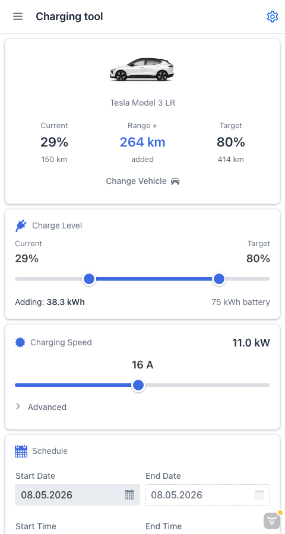

# EV stats

A web app for Finnish EV enthusiasts. Calculate the cost of a charging session against Nordic spot electricity prices, and browse statistics on EV registrations, adoption, and reliability in Finland.

Hosted at: https://auto.liukuri.fi



## Features

**Charging tool** (the home view) — estimate the cost and duration of a charging session:

- Pick a vehicle preset (battery capacity, consumption, brand styling)
- Set current and target charge level
- Configure the charger (kW, phases, voltage, charging loss)
- Schedule the session by start/end time and let the app solve for the missing endpoint
- Cost is calculated against real Finnish spot prices via the [liukuri.fi](https://liukuri.fi) API

**Statistics views** based on public Finnish data (Traficom, etc.):

- EV adoption curve — share of new registrations that are BEVs
- New EV registrations per month
- Cumulative BEV registrations by year
- Tesla registrations (line and bar)
- Used EVs on sale
- EV reliability league — periodic inspection fail rate by model
- Tesla reliability
- Defect breakdown — why cars fail periodic inspection

The UI is available in English and Finnish.

## Tech stack

- Vaadin Flow 24.9 (Java)
- Spring Boot
- Maven
- Playwright for end-to-end tests

## Running the application

The project is a standard Maven project. To run it from the command line, type `mvnw` (Windows) or `./mvnw` (Mac & Linux), then open http://localhost:8080 in your browser.

You can also import the project into your IDE of choice as you would with any Maven project. See [how to import Vaadin projects to different IDEs](https://vaadin.com/docs/latest/guide/step-by-step/importing) (Eclipse, IntelliJ IDEA, NetBeans, VS Code).

## Deploying to production

To create a production build, run `mvnw clean package -Pproduction` (Windows) or `./mvnw clean package -Pproduction` (Mac & Linux). This produces a JAR file with all dependencies and front-end resources in the `target` folder.

Run the production JAR with:

```
java -jar target/evstats-1.0-SNAPSHOT.jar
```

## Project structure

- `src/main/java/com/vesanieminen/views/charging/` — the charging tool view
- `src/main/java/com/vesanieminen/views/statistics/` — the statistics views
- `src/main/java/com/vesanieminen/views/MainLayout.java` — navigation shell ([App Layout](https://vaadin.com/docs/components/app-layout))
- `src/main/resources/messages*.properties` — i18n strings (EN / FI)
- `src/main/resources/data/` — bundled datasets (registrations, reliability)
- `frontend/themes/` — custom CSS, including per-brand themes for the charging tool
- `e2e/` — Playwright end-to-end tests
